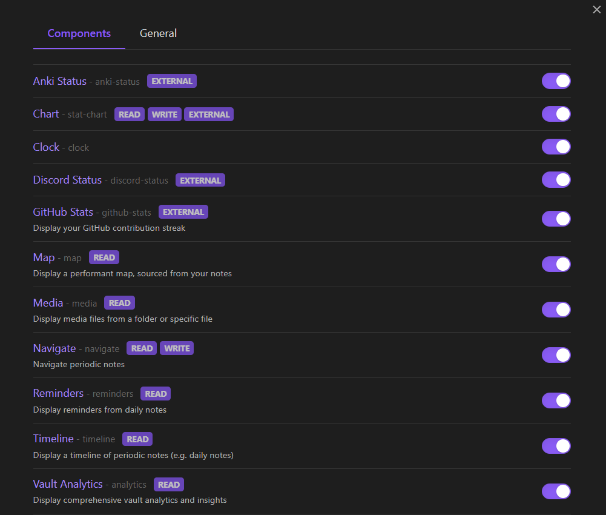

# Components

Adds custom components to Obsidian notes and sidebars.

## Available components
* **Analytics** - vault health
* **Anki status**
* **Clock**
* **Chart** - chart date-mapped array data
* **Discord status**
* **GitHub streak** - GitHub contribution streak
* **Navigate button** - navigate between periodic notes
* **Reminders** - due tasks from periodic notes
* **Timeline** - timeline of periodic notes
* **Widget space** - a customizable container for multiple components

## Usage
The easiest way to get started is by typing a codeblock and whichever component you want to use inside a note (e.g. \`\`\`reminders). This will prompt autocomplete by default, which will guide you through all the possible arguments for that component.

If you want to configure the codeblock manually,
each component accepts arguments in `KEY=value` format. Use `KEY!=value` to force CSS styling instead of component behavior[^1].

The plugin is best used with "Default view for new tabs" as "Reading view".

### Templater as an optional dependency
Some components make use of templates, and thus integrate with the very popular Templater plugin. If you plan on using templates, template creation will be much more seamless with Templater installed.

## Planned features
* Explicit mobile support[^2]
* Custom aliases/alias management
* Multiple column widget space
* Other stuff that I need

[^1]: If you want to be more declarative or if there is future namespace collision.
[^2]: It works now, but a few components require the Node API.

> **Note:** The Map component has been replaced by its own dedicated plugin: [Obsidian Map Plus](https://github.com/ccmdi/obsidian-map-plus) 